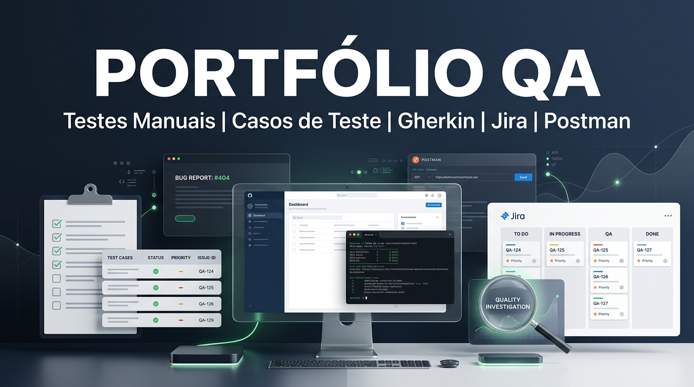

  

# William Morais Suppi

### Em transição para QA | Testes Manuais e Automatizados | Cypress | Playwright | CodeceptJS | Testes de API | Scrum | Documentação de Testes

***

## Sobre mim
Sou um profissional em transição para **Quality Assurance**, com foco em **testes manuais**, **testes funcionais**, **casos de teste**, **bug report**, **validação de fluxos** e evolução contínua em **testes de API**.

Minha trajetória profissional fortaleceu competências muito úteis para QA, como:
- análise criteriosa de informações
- investigação de inconsistências
- validação de regras e conformidade
- organização de evidências
- comunicação objetiva
- atenção aos detalhes

***

## Objetivo profissional
Busco oportunidade como **Analista de Testes Júnior / QA Júnior**, contribuindo com qualidade, rastreabilidade e melhoria contínua em produtos e times ágeis.

***

## Stack e conhecimentos

### QA e processos

- Testes manuais funcionais (web)
- Escrita e execução de casos de teste
- Registro de evidências e bug reports
- Validação de fluxos de negócio
- Noções de testes de API (em evolução)
- Uso de linguagem Gherkin para descrição de cenários
- Noções de trabalho com times ágeis (Scrum)

### Ferramentas

- Jira (gestão de demandas e acompanhamento de issues)
- Postman (requisições e testes básicos de API)
- Cypress (automação E2E web – projeto Mercado Livre)
- Git e GitHub (versionamento e portfólio)
- Notion (organização de estudos e anotações)
- Navegadores de desenvolvedor (DevTools para inspeção de elementos)

### Aprofundando

- Automação de testes com Cypress (aprofundando seletores, boas práticas e estrutura de projeto)
- Testes de API (melhor uso do Postman e escrita de cenários mais completos)
- Inglês aplicado a QA (comunicação profissional e leitura de documentação técnica)
- Fundamentos de programação (JavaScript e lógica para apoiar automação)
***

## Portfólio em destaque
### testes-saucedemo-login
Documentação de testes manuais aplicada ao módulo de login do SauceDemo, com foco em validação de fluxo, escrita de cenários e registro de evidências.

### mercado-livre-busca-cypress
Automação de teste E2E com Cypress para funcionalidade de busca no Mercado Livre, incluindo tratamento de navegação cross-origin.

### qa-automacao-codeceptjs 
automação de testes funcionais com foco em fluxos web.

### automacao-testes-api-codecepjs 
automação de testes de API com CodeceptJS, validação de endpoints e respostas.

***

## Formação e certificação
- **CST em Análise e Desenvolvimento de Sistemas** — Gran Faculdade
- **Scrum Foundation Professional Certification (SFPC)**
- Estudos contínuos em QA, testes de API, documentação de testes e ferramentas de apoio ao ciclo de qualidade

***

## Contato
- LinkedIn: [william-morais-suppi](https://www.linkedin.com/in/william-morais-suppi)
- GitHub: [williamsuppi-QA](https://github.com/williamsuppi-QA)
- E-mail: **williamsuppi@yahoo.com.br**

***

> Construindo uma base sólida em QA com portfólio prático, documentação de testes e evolução constante.

